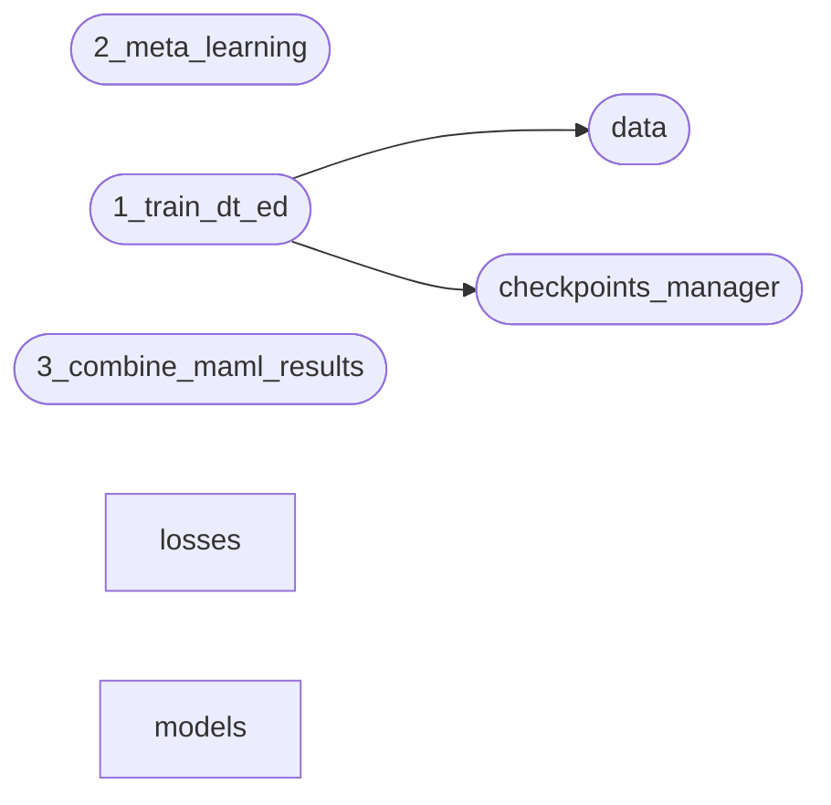

# Code Overview

[_Documentation generated by Documatic_](https://www.documatic.com)

<!---Documatic-section-Codebase Structure Python-start--->
## Codebase Structure Python

The codebase has a single-depth folder structure,
                with 15 code files in total.

<!---Documatic-block-system_architecture-start--->

<!---Documatic-block-system_architecture-end--->

# #
<!---Documatic-section-Codebase Structure Python-end--->

<!---Documatic-section-File IO-start--->
## File IO

<!---Documatic-block-file_io-start--->
The following files have file read operations

<!---Documatic-block-src-start--->

	
<code>src</code> (Click to Expand!)

* src.1_train_dt_ed: ./gazecapture_split.json
* src.3_combine_maml_results

<!---Documatic-block-src-end--->

The following files have file write operations

<!---Documatic-block-src-start--->

	
<code>src</code> (Click to Expand!)

* src.2_meta_learning

<!---Documatic-block-src-end--->
<!---Documatic-block-file_io-end--->

# #
<!---Documatic-section-File IO-end--->

<!---Documatic-section-Class Hierarchy-start--->
## Class Hierarchy

<!---Documatic-block-nn.Module-start--->

	
<code>nn.Module</code> (Click to Expand!)

* src.2_meta_learning.ModifiableModule
* src.models.densenet.DenseNet
* src.models.densenet.DenseNetInitialLayers

<!---Documatic-block-nn.Module-end--->

<!---Documatic-block-object-start--->

	
<code>object</code> (Click to Expand!)

* src.2_meta_learning.MAML
* src.checkpoints_manager.CheckpointsManager

<!---Documatic-block-object-end--->

<!---Documatic-block-src.2_meta_learning.MAML-start--->

	
<code>src.2_meta_learning.MAML</code> (Click to Expand!)

* src.2_meta_learning.FOMAML
* src.2_meta_learning.MetaSGD
* src.2_meta_learning.NONE

<!---Documatic-block-src.2_meta_learning.MAML-end--->

<!---Documatic-block-src.2_meta_learning.ModifiableModule-start--->

	
<code>src.2_meta_learning.ModifiableModule</code> (Click to Expand!)

* src.2_meta_learning.GazeEstimationModel
* src.2_meta_learning.GazeEstimationModelPreExtended
* src.2_meta_learning.GradLinear

<!---Documatic-block-src.2_meta_learning.ModifiableModule-end--->

<!---Documatic-block-src.data.HDFDataset-start--->

	
<code>src.data.HDFDataset</code> (Click to Expand!)

* src.data.HDFDataset

<!---Documatic-block-src.data.HDFDataset-end--->

# #
<!---Documatic-section-Class Hierarchy-end--->

[_Documentation generated by Documatic_](https://www.documatic.com)